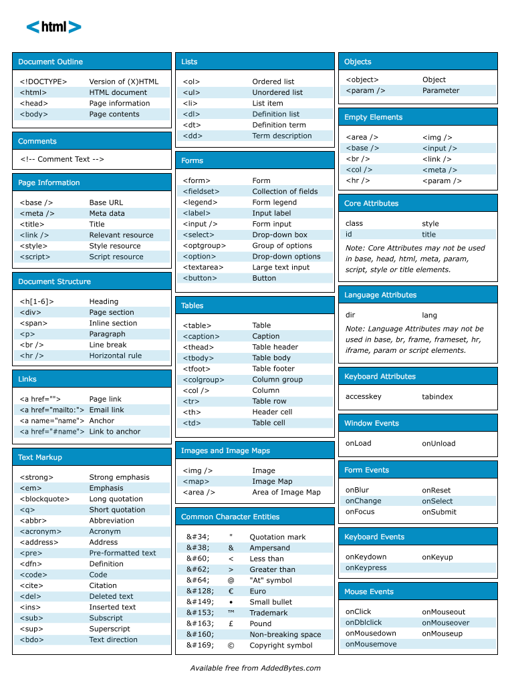

# Intro to HTML & the DOM

## Table of Contents
* [Learning Objectives](#learning-objectives)
* [Preparation](#preparation)
* [Differentation between HTML and DOM](#differentation-between-html-and-dom)
* [Introduction to HTML tags](#introduction-to-html-tags)
* [Creating a table in HTML](#creating-a-table-in-html)
* [Google Chrome Developer Tools](#google-chrome-developer-tools)
* [HTML 5 Tags](#html-5-tags)
* [Other Topics](#other-topics)
* [Additional Resources](#additional-resources)
* [Exercise #1](#exercise-#1)
* [Exercise #2](#exercise-#2)


## Learning Objectives
* Build a simple web page using HTML
* Explain the various parts of an HTML document, including:
  - the `<head>` and `<body>` tags
  - container elements such as `<div>`, `<header>`, `<footer>`, `<section>`, and `<article>`
  - common elements such as `<h1>`, `<h2>`, `<p>`, `<ul>`, and `<li>`
* Explain the difference between _HTML_ and the _DOM_

## Preparation
- Pre-work and About Me page completion

## Hook (5m)
This morning we're gonna take a look at the DOM and how we can use the Chrome Dev Tools to manipulate and test it out. This afternoon we'll use more advanced ways to perform DOM manipulation using Javascript.

<details>
<summary>To start, can someone describe the difference between HTML and the DOM in their own words?</summary>
The DOM (Document Object Model) is the browser's intrepretation of the HTML. Your browser creates objects out of the HTML elements.

examples: 

- skeleton => HTML, body => DOM
- song chords, lyrics => HTML, recorded song => DOM
- recipe ingredients => HTML, finished dish => DOM

</details>


**WE DO:** Goto [Kickass App](http://kickassapp.com/) and use it. What is happening?


We're gonna get into DOM manipulation later in the week, but to demonstrate the difference between an _HTML_ document and the _DOM_ that is created from the _HTML_ document, let's go to the [Jezebel](http://jezebel.com/) web site and play around with some headlines.

Using the Chrome DevTools Inspector, alter something on the page.


**YOU DO** Go to [Atlanta Craigslist](https://atlanta.craigslist.org/) and try running the following `javascript` DOM manipulation code in the JavaScript console:

```javascript
document.getElementById('logo').children[0].text = 'MarensList';
document.getElementsByClassName('ban')[0].children[0].text = 'WDI Rocks!'
```

Questions:

<details>
<summary>Did I just hack Craigslist?</summary>
No. We manipulated the DOM, or what existed in the browser's memory.
</details>
<details>
<summary>What happens if I refresh the page?</summary>
All of your changes will disappear.  
</details>
<details>
<summary>What are we actually changing - the HTML or the DOM?</summary>
You are changing the DOM.  The developers at Craigslist will not be worried that their site is now called 'MarensList'.
</details>

<br />

---

## **YOU DO**
- 5 min - Read this article on the difference between HTML and the DOM from [CSS Tricks](https://css-tricks.com/dom/) 
- 5 min - Pair and Share - discuss what you learned with your partner
- 5 min - Ask each group for something they learned in the article

<br />

---

## Let's Differentiate between HTML and the DOM

* **HTML**: the language we use to create an HTML Page/Document
* **DOM**: the Document Object Model, i.e. the in-memory representation of the HTML page, that is created every time the browser _renders_ the HTML document.

**Note**: the _DOM_ can be _manipulated_ via _JavaScript_ code.  And we will discuss this in further detail next week.

<br />

### What is HTML?
**HTML** stands for "Hyper Text Markup Language". It is not a general purpose programming language like *JavaScript* or _Ruby_ but rather a **markup language**, i.e. a language for representing structured text.

To create any website, you need HTML, CSS and JavaScript.  While CSS provides the style and color for a site, and JavaScript allows interaction with the end user, HTML creates the skeleton of a website. It is the *structured content*.


The `<head>` section is for metadata, which gives the browser information about the site.  Inside of the head, we would add the title of our website- which is what you see in the browser tab, any link tags to css pages.     

The `<body>` section is for the visible content on a web page.  As well as our JavaScript `<script>` tags.

```html
<!doctype html>
<html>
  <head>
    <!-- document metadata goes here. -->
  </head>
  <body>
    <!-- document contents go here. -->
  </body>
</html>
```

<br />

### What is the DOM?

- A browser receives a page as HTML and creates a **Document Object Model** (a.k.a. the DOM tree) that it stores in memory.  The DOM defines a standard for accessing your HTML document.


- The DOM is a **tree-like structure** or data structure, similar to an outline, that consists of parent and child nodes that represent each element on our site.
- The DOM has properties (a value that you can get or set), methods (an action that you can do) and events (what happens when a user interacts with the page- by clicking on a button or mousing over an element).
- The DOM defines each HTML **element** is an object. These objects may be accessed and modified, using properties and methods, in order to change them.

- In the console, type `document.` and check out the available methods.
- In the console, type `document.title`.
<details>
<summary>What do you expect to see?</summary>
The `document.title` is going to output the title of the website, or what you see in your browser tab.
</details>
- In the console, type `document.body.children[5]`.
<details>
<summary>What do you expect to see?</summary>
This statement will highlight the main content div, and we can click through and highlight other content from there.
</details>


#### **WE DO**
- Go to Jezebel.
- In the console, type `document.getElementsByClassName('headline')[0];`
  - We will discuss this more later, but getElementsByClassName, returns an array/list of items with that class.  Arrays are zero-indexed, which means that they start with zero, so we need to add that number in square brackets to highligh the first title. 
  - This will highlight the first news title on the page.
- Update that title to have the id="first-title"
  - The funny thing is that Jezebel doesn't really use ids, so in order to access and Id, we need to take the initiative to add it ourselves.
- In the console, type `document.getElementById('first-title');`
  - This statement will also highlight the first news title on the page, but in a different way.

- As with our earlier Jezebel example, you can change the HTML in the inspector but when you re-render the page, the changes are gone. Try `document.write('WDI Rocks!!!')`. (Traditionally, you only use document.write for testing purposes because you don't have any control over where it renders on the page, and it overwrites everything else).

<br />

## What is the Window Object?

- The **Window Object** represents the window that is open in the browser.
- The location property is the URL of the page.
- In the console, type `window.` and check out the available methods.
<details>
<summary>Do you recognize any of these methods?</summary>
`alert()` will alert a message to the user.
`focus()` will set the focus/cursor in an input box- this is helpful with forms. 
`prompt()` displays a dialogue box to the user.
`setInterval()` calls a function or expression at specified intervals (in milliseconds).
`setTimeOut()` calls a function or expression after a certain amount of time (in milliseconds).
</details>
- In the console, type `window.location`.
<details>
<summary>What do you expect to see?</summary>
`window.location.href` returns the href (URL) of the current page
`window.location.hostname` returns the domain name of the web host
`window.location.pathname` returns the path and filename of the current page
`window.location.protocol` returns the web protocol used (http: or https:)
`window.location.assign` loads a new document
</details>
- In the console, type `window.document.write('Hello')`.
<details>
<summary>Knowing what happened before, what do you expect this statement to do?</summary>
It will write over everything that exists on the webpage with the string 'Hello'.  Notice that this is similar to `document.write`.  The only difference is that we added `window.` in front of that statement.  `Document`, returns the document object for the window.  Often, the `window.` is left off of window object methods.
</details>

<br />

## HTML vs. DOM Vocabulary

| HTML          | DOM           |  Example                              |
|:-------------:|:-------------:|:------------------------------------- |
| tag / element | node          | `<p>This is a paragraph</p>`          |
| attribute     | property      | `<a href="www.google.com">Google</a>` |

<br />

## Introduction to HTML tags

**YOU DO**

Go to this [HTML Practice Exercise](https://github.com/ATL-WDI-Exercises/html-dom/blob/master/html_practice_exercise.md) and follow the instructions to build a basic webpage in 15 minutes. Based on the screenshots of your sites, sent to me in slack, I will then choose a student to demo what they have built.  We will then go over the review notes below.

### Basic Structure of an HTML Document

* `<!DOCTYPE html>` -> informs the browser that this file is an HTML file
* `<html>...</html>` -> contains your html content - it will tell the browser that everything within these tags should be interpreted as HTML.

When creating a new html file, you must include a `<head>` section, along with a `<title>`.

```html
<head>
  <title>Page's title</title>
  <meta name="description" content="...">
  <meta name="keywords">
</head>
```

The `head` section is important for search engines, as it helps provide additional information about the website. Anything within the opening and closing `<head>` tags will **NOT** be displayed on the page.

The `<head>` tags are placed right after the opening `<html>` tag, and before the opening `<body>` tag.


## Common HTML Elements

### Meta Tags

| Element        | Description                                               |
|:-------------- |:--------------------------------------------------------- |
| `<link>`       | used to load a CSS file - it is self closing. |
| `<script>`     | used to load a JavaScript file or for embedding JavaScript code. **Although any script tags should really be at the bottom of your html page** |
<details>
<summary>Does anyone know why?</summary>
If your `<script>` tags are placed in the `<head>` of your document, your html will wait to render until the javaScript has been loaded.
</details>

### Containers

| Element        | Description                                               |
|:-------------- |:--------------------------------------------------------- |
| `<head>`       | contains metadata about the page, including the title, links to external stylesheets, js files, google fonts, etc, and other meta tags. |
| `<body>`       | contains the body of the page to be displayed. |
| `<div>`        | a container used for grouping child elements. Divs are **block elements** that take up the whole width of the page unless specific style is applied to them to do otherwise. They can contain paragraphs, headings, text, images, other divs, etc. They work as a way to structure the page with clearly delimited blocks. |
| `<ul>...</ul>` | an unordered list with bullet points before the `<li>` elements |
| `<ol>...</ol>` | an ordered list with numbers before the `<li>` elements |

### Content

| Element       | Description                                               |
|:------------- |:--------------------------------------------------------- |
| `<p>...</p>`   | a simple paragraph |
| `<span>...</span>`  | **inline element**, allows us to isolate a bit of text and apply a specific/different style to it using CSS. |
| `<h1>...</h1>` | Level 1 heading. Used to show the most important element on the page. |
| `<h2>...</h2>` | Level 2 heading. Used for the second most important element on the page.  And so on... |
| `<h3>...</h3>` | Level 3 heading |
| `<h4>...</h4>` | Level 4 heading |
| `<h5>...</h5>` | Level 5 heading |
| `<h6>...</h6>` | Level 6 heading |
| `<li>...</li>` | li elements are used for each item in an ordered/unordered list |
| ` ` | an image tag. This is a self-closing, inline element tag, meaning you don't need a closing </img> tag. An image tag should include the source/**src attribute** of the file (which can be a url or a relative file path) and a description/**alt attribute** for search engines and screen readers.  If you turn in work without alt tags, you will be docked for that.  It is extremely important to include them.
| `<a href="url">...</a>` | a link tag provides a hyperlink to another page. A link tag needs to include an **href attribute** which is the url to which it is linking. If you add `target="_blank`, the link will open in a new tab, in the browser. 

You can also wrap images within `<a>` tags to transform them into a link.

#### Example of an Anchor containing an Image

```html
<a href="www.w3.org" target="_blank">
  
</a>
```

The `href` attribute above makes the image of Sir Timothy John Berners-Lee "clickable" and redirects the user to the W3 website.

<details>
<summary>Who is Sir Timothy John Berners-Lee?</summary>
Sir Timothy John Berners-Lee invented the World Wide Web in 1989.  He founded and Directs the World Wide Consortium (W3C) which oversees the continued development of the web. He also founded the World Wide Web Foundation whose mission is for the WWW to serve Humanity through improvement and availability, and he co-founded the Open Data Institute in London.
</details>


<br />

### Styled Text

These tags can be used to set a specific style to text in an HTML document.

> NOTE: Traditionally, these tags are avoided, as it is better to use CSS for styling content.

| Element       | Description                                               |
|:------------- |:--------------------------------------------------------- |
| `<b>...</b>` | makes the wrapped text bold- only changing the style. |
| `<strong>...</strong>` | similar to bold; the browser and screen readers interpret this as an important bit of text, and will direct the reader's attention to it.  `<strong>` tags are preferred over `<b>` tags. |
| `<i>...</i>` | makes the wrapped text italic- only changing the style. |
| `<em>...</em>` | similar to italic; it is used by the browser and screen readers to add emphasis to a word. `<em>` tags are preferred over `<i>` tags. |
| `<br />` | a self-closing tag, allowing you to break the content (CSS will allow us to achieve the same result, in a more controlled way- by using margins or padding). |

<br />

### Creating a table in HTML

We can use the `<table>` tags to display tabular data.

Table-specific tags:

| Element       | Description                                               |
|:------------- |:--------------------------------------------------------- |
| `<table>...</table>`  | contains the table data, and defines the table structure |
| `<thead>...</thead>`  | the head of the table (bolder text) - optional
| `<tr>...</tr>` | defines a row
| `<th>...</th>` | defines a cell within that row
| `<tbody>...</tbody>` | the body of the table


Example:

```html
  <table border="1">
    <thead>
      <tr>
        <th>Date</th>
        <th>Weight</th>
        <th>Distance walked</th>
      </tr>
    </thead>
    <tbody>
      <tr>
        <td>September 15</td>
        <td>75 kg</td>
        <td>1.8 km</td>
      </tr>
      <tr>
        <td>September 29</td>
        <td>73 kg</td>
        <td>2.1 km</td>
      </tr>
    </tbody>
  </table>
```

In the browser, this outputs:

Date | Weight | Distance Walked
-----|--------|-----------------
September 15 | 75 kg |1.8 km
September 29 |73 kg | 2.1 km

> **REMEMBER**: Don't use tables to define the layout of a page! This is a very old and outdated technique that results in a poor overall design that is not easily styled with CSS and is not *responsive* to varying screen sizes.

---

## HTML Cheatsheet



---

## Google Chrome Developer Tools

Let us have a quick first look at **Chrome Developer Tools**. Available as a console in Google Chrome, it allows us to get a lot of information about the page we are on, providing a detailed look into the HTML structure of the page as well as the CSS styling, among other things.

In Chrome, you can access it with:
  - `Cmd + Alt + i` on a Mac
  - `Ctrl + Shift + C` or `F12` on Windows or Linux
  - or right-click on the browser and click on the "Inspect element" option

As of now, let's mainly look at the "Elements" tab -> This tab is a very powerful way to look at the page structure, and locate specific elements within the page as well as view their styles.

You can gain some useful information on all of the elements by looking at the data on the right column of the console, most notably the CSS properties that are currently applied to the elements. You can change them/"live" update them to play around with different styles. These changes, however, only apply to the page that is displayed, you are only updating the DOM - they will not save to your CSS file unless you manually add them, and they will disappear on the next page reload.

We will play with this functionality more when we dig deeper into CSS.

---

## HTML 5 Tags

See [HTML5 New Elements](http://www.w3schools.com/html/html5_new_elements.asp)

---

## Other Topics

For information on accessibility and search engine optimization, see [Accessibility and SEO](accessibility-and-seo.md).

For information on HTML5 Boilerplate, see [HTML5 Boilerplate](html5-boilerplate.md).

---

## Additional Resources

* [Online HTML live editor](https://thimble.webmaker.org/en-US/projects/wrangler/)
* [HTML element reference](https://developer.mozilla.org/en-US/docs/Web/HTML/Element)
* [HTML Elements by Category](http://www.w3schools.com/tags/ref_byfunc.asp)
* [HTML5 element reference](https://developer.mozilla.org/en/docs/Web/Guide/HTML/HTML5/HTML5_element_list)
* [Tim Berners-Lee](http://www.w3.org/People/Berners-Lee)
* [Evolution of the Web - Great Link](http://www.evolutionoftheweb.com/)
* [Stack Overflow: What is the difference between Section and Div](http://stackoverflow.com/questions/6939864/what-is-the-difference-between-section-and-div)
* [HTML5 Doctor](http://html5doctor.com/)
* [HTML5 Validator](http://html5.validator.nu/)
* [Semantic HTML](http://en.wikipedia.org/wiki/Semantic_HTML)
* [CSS Tricks](https://css-tricks.com/dom/)

---

## Exercise #1

Using HTML tags only (don't worry about CSS), use the starter code below to recreate the Document Outline for the following website:

[How We Use Energy](http://needtoknow.nas.edu/energy/energy-use/)

* [Starter Code](https://github.com/ATL-WDI-Exercises/html-dom/blob/master/energy_dom_outline/energy_document_outline.html)
* [Finished Code](https://github.com/ATL-WDI-Exercises/html-dom/blob/master/energy_dom_outline/energy_document_outline_fin.html)

## Exercise #2

Clone your HTML/DOM repo and work on the [Busy Hands](https://github.com/ATL-WDI-Exercises/busy-hands) exercise.
